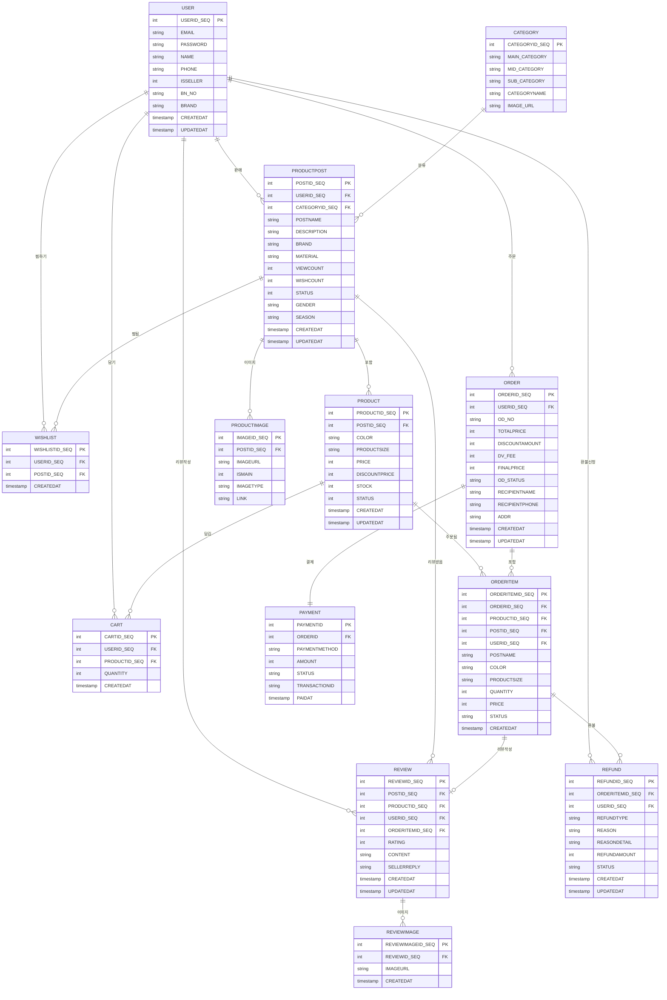
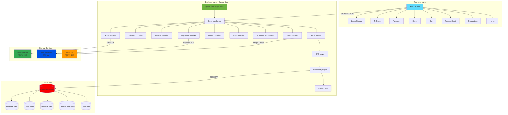
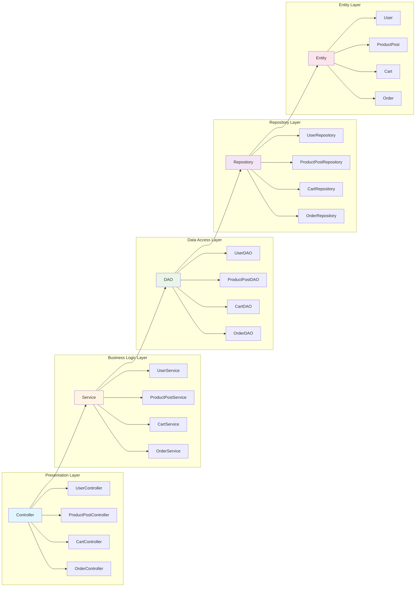
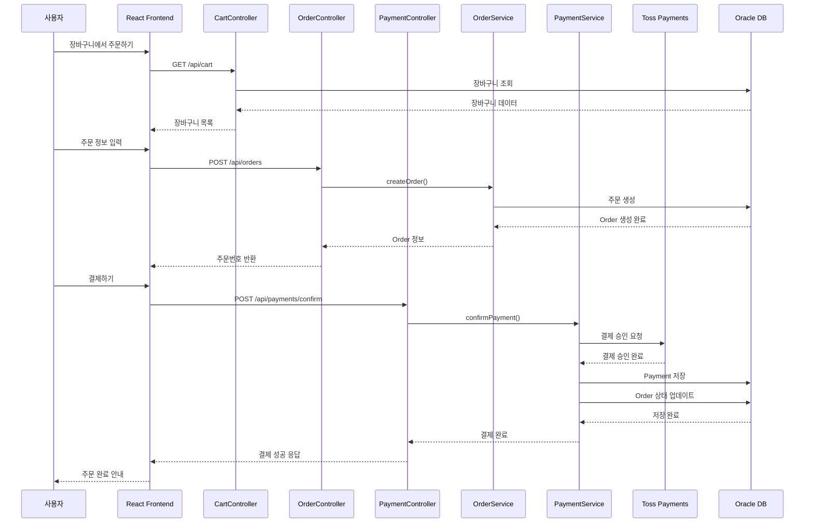
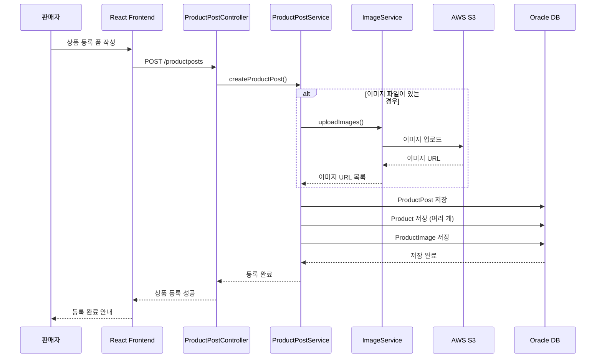
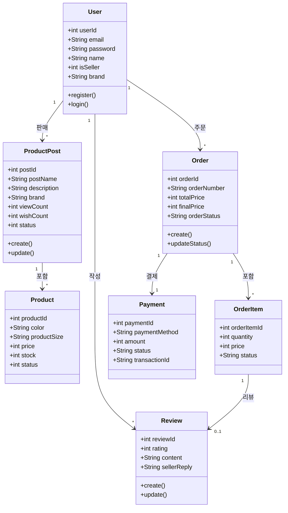
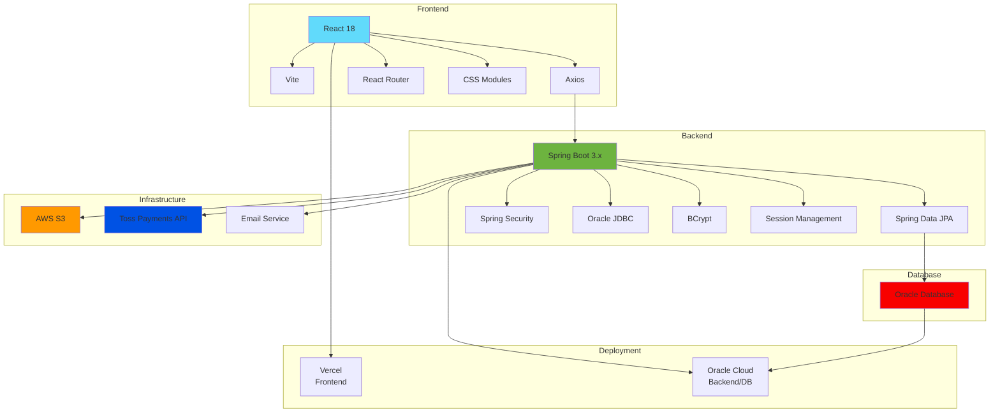
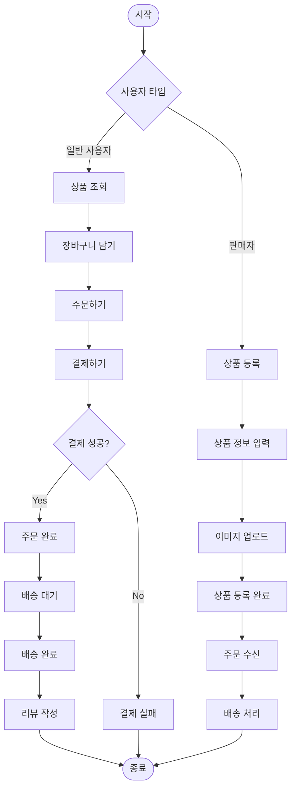

# 단성사 쇼핑몰 프로젝트 UML 다이어그램

프레젠테이션용 UML 다이어그램 모음

## 1. ERD (Entity Relationship Diagram)

### 데이터베이스 구조

## 2. 시스템 아키텍처 다이어그램

### 전체 시스템 구조

## 3. 레이어별 아키텍처

### 백엔드 레이어 구조

## 4. 주요 기능 시퀀스 다이어그램

### 주문 및 결제 흐름

### 상품 등록 흐름

## 5. 클래스 다이어그램 (주요 엔티티)

### 핵심 엔티티 관계

## 6. 사용 기술 스택

### 기술 아키텍처

## 7. 데이터 흐름도

### 주요 비즈니스 프로세스

## 사용 방법

### Mermaid 다이어그램 렌더링

1. **GitHub/GitLab**: `.md` 파일을 업로드하면 자동으로 렌더링됩니다.
2. **VS Code**: Mermaid 확장 프로그램 설치 후 미리보기 가능
3. **온라인 에디터**: [Mermaid Live Editor](https://mermaid.live/)에 코드 복사해서 사용
4. **PowerPoint/발표자료**: 
   - Mermaid Live Editor에서 SVG/PNG로 내보내기
   - 또는 [diagrams.net](https://app.diagrams.net/)에서 직접 그리기

### 추천 프레젠테이션 구성

1. **시스템 아키텍처** (2번 다이어그램) - 전체 구조 소개
2. **ERD** (1번 다이어그램) - 데이터베이스 설계 설명
3. **주요 기능 시퀀스** (4번 다이어그램) - 핵심 기능 흐름 설명
4. **기술 스택** (6번 다이어그램) - 사용 기술 소개

각 다이어그램은 필요에 따라 편집하여 사용하세요!

